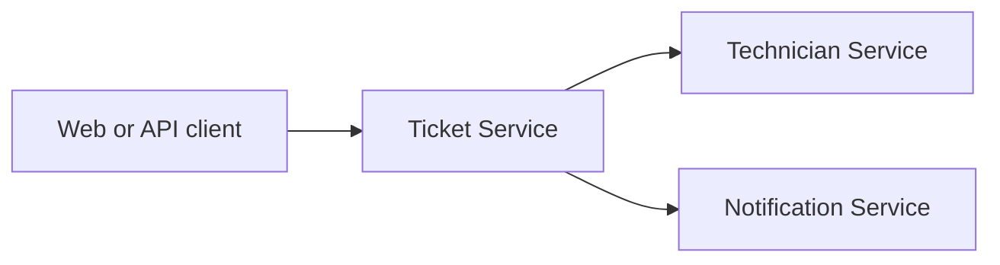

# ServiceDesk Cloud Platform

[](https://github.com/itqaanconsulting/servicedesk-cloud-platform/actions/workflows/build.yml)

Cloud-native service desk showcase built as independently deployable Java microservices. The project focuses on service boundaries, synchronous communication, resilience, observability and Kubernetes deployment.

## Services

| Service | Port | Responsibility |
| --- | ---: | --- |
| Ticket Service | 8081 | Ticket lifecycle, priority and assignment |
| Technician Service | 8082 | Technician skills, teams and availability |
| Notification Service | 8083 | Notification delivery and audit history |

## Architecture



Each service owns its domain and will receive its own PostgreSQL database. Calls between services remain explicit REST contracts. Resilience, tracing and metrics will be added around those calls.

## Technology

- Java 21
- Spring Boot 3.5
- Maven multi-module build
- Spring Boot Actuator and Prometheus metrics
- Docker Compose
- GitHub Actions

Planned platform capabilities include PostgreSQL, Flyway, Resilience4j, OpenTelemetry, Prometheus, Grafana, Kubernetes and Terraform.

## Build

```powershell
mvn clean verify
```

## Run a Service

```powershell
mvn -pl services/ticket-service spring-boot:run
```

Available endpoints:

- `http://localhost:8081/api`
- `http://localhost:8081/actuator/health`
- `http://localhost:8081/actuator/prometheus`

The technician and notification services expose the same endpoints on ports `8082` and `8083`.

## Run with Docker

Build the application jars first:

```powershell
mvn clean package
docker compose up --build
```

## Delivery Roadmap

1. Implement ticket and technician persistence with separate PostgreSQL databases.
2. Add synchronous ticket assignment with timeout, retry and circuit breaker behavior.
3. Add distributed tracing and a local observability dashboard.
4. Package all services for Kubernetes with health probes and resource limits.
5. Provision a cloud environment using Terraform.

## Project Structure

```text
services/
  ticket-service/
  technician-service/
  notification-service/
compose.yml
pom.xml
```
