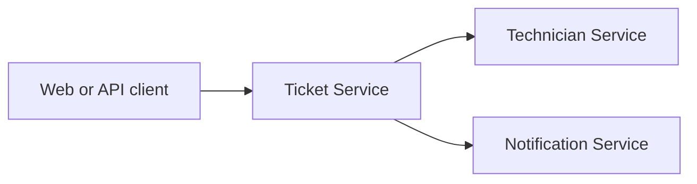

# ServiceDesk Cloud Platform

[](https://github.com/itqaanconsulting/servicedesk-cloud-platform/actions/workflows/build.yml)

Cloud-native service desk showcase built as independently deployable Java microservices. The project focuses on service boundaries, synchronous communication, resilience, observability and Kubernetes deployment.

## Services

| Service | Port | Responsibility |
| --- | ---: | --- |
| Ticket Service | 8181 | Ticket lifecycle, priority and assignment |
| Technician Service | 8082 | Technician skills, teams and availability |
| Notification Service | 8083 | Notification delivery and audit history |

## Architecture



Each service owns its domain and database. The Ticket and Technician services persist their data in separate PostgreSQL databases through versioned Flyway migrations. Ticket assignment uses an explicit REST contract with retries, timeouts and a circuit breaker.

## Technology

- Java 21
- Spring Boot 3.5
- Maven multi-module build
- Spring Boot Actuator and Prometheus metrics
- Resilience4j
- Docker Compose
- GitHub Actions

Planned platform capabilities include OpenTelemetry, Grafana, Kubernetes and Terraform.

## Build

```powershell
mvn clean verify
```

## Run a Service

```powershell
mvn -pl services/ticket-service spring-boot:run
```

Available endpoints:

- `http://localhost:8181/api`
- `POST http://localhost:8181/api/tickets`
- `GET http://localhost:8181/api/tickets`
- `GET http://localhost:8181/api/tickets/{ticketId}`
- `PATCH http://localhost:8181/api/tickets/{ticketId}/status`
- `POST http://localhost:8181/api/tickets/{ticketId}/assignment`
- `http://localhost:8181/actuator/health`
- `http://localhost:8181/actuator/prometheus`

The technician and notification services expose the same endpoints on ports `8082` and `8083`.

Technician endpoints:

- `POST http://localhost:8082/api/technicians`
- `GET http://localhost:8082/api/technicians`
- `GET http://localhost:8082/api/technicians?skill=JAVA&availability=AVAILABLE`
- `GET http://localhost:8082/api/technicians/{technicianId}`
- `PATCH http://localhost:8082/api/technicians/{technicianId}/availability`
- `POST http://localhost:8082/api/technicians/reservations?skill=JAVA`

Create a ticket:

```powershell
$body = @{
    title = "VPN access unavailable"
    description = "Remote employee cannot connect to the corporate VPN."
    requesterEmail = "alex@example.com"
    priority = "HIGH"
    requiredSkill = "NETWORKING"
} | ConvertTo-Json

Invoke-RestMethod `
    -Method Post `
    -Uri http://localhost:8181/api/tickets `
    -ContentType application/json `
    -Body $body
```

## Assignment Flow

1. Create a ticket with `requiredSkill`.
2. Call `POST /api/tickets/{ticketId}/assignment`.
3. Ticket Service asks Technician Service to atomically reserve an available technician.
4. A successful assignment moves the ticket to `IN_PROGRESS` and the technician to `BUSY`.
5. If no technician is available, or the remote service times out, the ticket remains `UNASSIGNED`.

The Technician Service call has a 500 ms connection timeout, a one-second response timeout, three retry attempts and a circuit breaker. Resilience metrics are exposed through the Ticket Service Prometheus endpoint.

## Run with Docker

Build the application jars first:

```powershell
mvn clean package
docker compose up --build
```

## Delivery Roadmap

1. Add distributed tracing and a local observability dashboard.
2. Package all services for Kubernetes with health probes and resource limits.
3. Provision a cloud environment using Terraform.

## Project Structure

```text
services/
  ticket-service/
  technician-service/
  notification-service/
compose.yml
pom.xml
```
