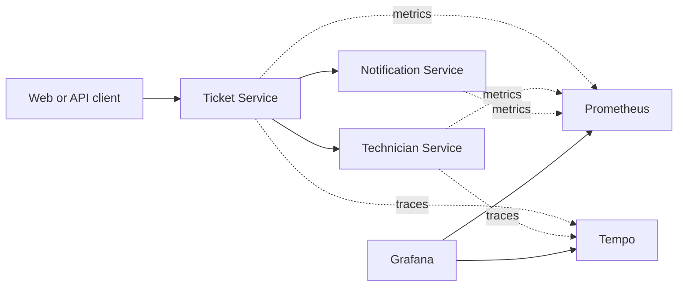

# ServiceDesk Cloud Platform

[](https://github.com/itqaanconsulting/servicedesk-cloud-platform/actions/workflows/build.yml)
[](https://github.com/itqaanconsulting/servicedesk-cloud-platform/actions/workflows/terraform.yml)

Cloud-native service desk showcase built as independently deployable Java microservices. The project focuses on service boundaries, synchronous communication, resilience, observability, Kubernetes deployment and infrastructure as code.

## Services

| Service | Port | Responsibility |
| --- | ---: | --- |
| Ticket Service | 8181 | Ticket lifecycle, priority and assignment |
| Technician Service | 8082 | Technician skills, teams and availability |
| Notification Service | 8083 | Notification delivery and audit history |

## Architecture



Each service owns its domain and database. The Ticket and Technician services persist their data in separate PostgreSQL databases through versioned Flyway migrations. Ticket assignment uses an explicit REST contract with retries, timeouts and a circuit breaker.

## Technology

- Java 21
- Spring Boot 3.5
- Maven multi-module build
- Spring Boot Actuator and Prometheus metrics
- OpenTelemetry distributed tracing
- Prometheus, Grafana and Tempo
- Resilience4j
- Docker Compose
- Kubernetes
- Terraform and Azure Container Apps
- GitHub Actions

## Build

```powershell
mvn clean verify
```

## Run a Service

```powershell
mvn -pl services/ticket-service spring-boot:run
```

Available endpoints:

- `http://localhost:8181/api`
- `POST http://localhost:8181/api/tickets`
- `GET http://localhost:8181/api/tickets`
- `GET http://localhost:8181/api/tickets/{ticketId}`
- `PATCH http://localhost:8181/api/tickets/{ticketId}/status`
- `POST http://localhost:8181/api/tickets/{ticketId}/assignment`
- `http://localhost:8181/actuator/health`
- `http://localhost:8181/actuator/prometheus`

The technician and notification services expose the same endpoints on ports `8082` and `8083`.

Technician endpoints:

- `POST http://localhost:8082/api/technicians`
- `GET http://localhost:8082/api/technicians`
- `GET http://localhost:8082/api/technicians?skill=JAVA&availability=AVAILABLE`
- `GET http://localhost:8082/api/technicians/{technicianId}`
- `PATCH http://localhost:8082/api/technicians/{technicianId}/availability`
- `POST http://localhost:8082/api/technicians/reservations?skill=JAVA`

Create a ticket:

```powershell
$body = @{
    title = "VPN access unavailable"
    description = "Remote employee cannot connect to the corporate VPN."
    requesterEmail = "alex@example.com"
    priority = "HIGH"
    requiredSkill = "NETWORKING"
} | ConvertTo-Json

Invoke-RestMethod `
    -Method Post `
    -Uri http://localhost:8181/api/tickets `
    -ContentType application/json `
    -Body $body
```

## Assignment Flow

1. Create a ticket with `requiredSkill`.
2. Call `POST /api/tickets/{ticketId}/assignment`.
3. Ticket Service asks Technician Service to atomically reserve an available technician.
4. A successful assignment moves the ticket to `IN_PROGRESS` and the technician to `BUSY`.
5. If no technician is available, or the remote service times out, the ticket remains `UNASSIGNED`.

The Technician Service call has a 500 ms connection timeout, a one-second response timeout, three retry attempts and a circuit breaker. Resilience metrics are exposed through the Ticket Service Prometheus endpoint.

## Run with Docker

Build the application jars first:

```powershell
mvn clean package
docker compose up --build
```

## Observability

The local stack is provisioned automatically:

| Tool | URL | Purpose |
| --- | --- | --- |
| Grafana | `http://localhost:3000` | Metrics dashboards and trace exploration |
| Prometheus | `http://localhost:9090` | Metrics collection and PromQL |
| Tempo | `http://localhost:3200` | Distributed trace storage |

Grafana credentials are `admin` / `admin`. Open the **ServiceDesk / ServiceDesk Overview** dashboard after generating traffic.

To inspect a distributed trace:

1. Create a technician with the required skill.
2. Create a ticket and call its assignment endpoint.
3. Open Grafana **Explore** and select the Tempo datasource.
4. Search recent traces for `ticket-service`.
5. Open a trace to see the Ticket Service request and its Technician Service child span.

To demonstrate resilience:

```powershell
docker compose stop technician-service
```

Call the assignment endpoint several times. The ticket remains `UNASSIGNED`, while retry and circuit-breaker metrics become visible in Grafana. Restore the service with:

```powershell
docker compose start technician-service
```

## Kubernetes

The `k8s/base` manifests deploy:

- A dedicated `servicedesk` namespace
- Three Spring Boot Deployments and ClusterIP Services
- Separate PostgreSQL StatefulSets and persistent volume claims
- ConfigMap and Secret based configuration
- Startup, readiness and liveness probes
- CPU and memory requests and limits

Docker Desktop Kubernetes can use the locally built images directly:

```powershell
.\scripts\deploy-kubernetes.ps1
```

Check the rollout:

```powershell
kubectl get pods,services,pvc -n servicedesk
```

Expose the Ticket Service locally:

```powershell
kubectl port-forward service/ticket-service 8281:8081 -n servicedesk
```

The database credentials in `k8s/base/database-secret.yml` are local demo values. A cloud deployment should inject credentials from a managed secret store instead of committing production secrets.

Remove the local deployment while preserving the Docker images:

```powershell
kubectl delete -k k8s/base
```

## Azure Infrastructure

The Terraform configuration in `infra/terraform/azure` provisions:

- Azure Resource Group
- Azure Container Registry with admin access disabled
- User-assigned managed identity with the `AcrPull` role
- Azure Container Apps environment with Log Analytics
- PostgreSQL Flexible Server with separate ticket and technician databases
- Three autoscaling Container Apps with health probes
- Public ingress for Ticket Service and internal ingress for supporting services

An Azure subscription, Terraform CLI and Azure CLI are only required for an actual deployment. GitHub Actions runs formatting and static validation without Azure credentials.

Authenticate and create a local variables file:

```powershell
az login
az account set --subscription "<subscription-id>"
Copy-Item infra/terraform/azure/terraform.tfvars.example infra/terraform/azure/terraform.tfvars
```

Provision the shared infrastructure first. Service deployment is disabled by default because the private images do not exist yet:

```powershell
terraform -chdir=infra/terraform/azure init
terraform -chdir=infra/terraform/azure apply
```

Build the jars and publish the service images through Azure Container Registry:

```powershell
mvn clean package
$registry = terraform -chdir=infra/terraform/azure output -raw container_registry_name

az acr build --registry $registry --image ticket-service:latest --file services/ticket-service/Dockerfile services/ticket-service
az acr build --registry $registry --image technician-service:latest --file services/technician-service/Dockerfile services/technician-service
az acr build --registry $registry --image notification-service:latest --file services/notification-service/Dockerfile services/notification-service
```

Enable the Container Apps in `terraform.tfvars`:

```hcl
deploy_services = true
```

Apply again and retrieve the public endpoint:

```powershell
terraform -chdir=infra/terraform/azure apply
terraform -chdir=infra/terraform/azure output ticket_service_url
```

The demo configuration uses the smallest burstable PostgreSQL tier and one database server with two logical databases to limit cost. The firewall allows traffic from Azure services. A production setup should use private networking, separate lifecycle policies and remote encrypted Terraform state.

Destroy demo resources when they are no longer needed:

```powershell
terraform -chdir=infra/terraform/azure destroy
```

## Project Structure

```text
services/
  ticket-service/
  technician-service/
  notification-service/
observability/
  grafana/
  prometheus/
  tempo/
k8s/
  base/
infra/
  terraform/
    azure/
compose.yml
pom.xml
```
